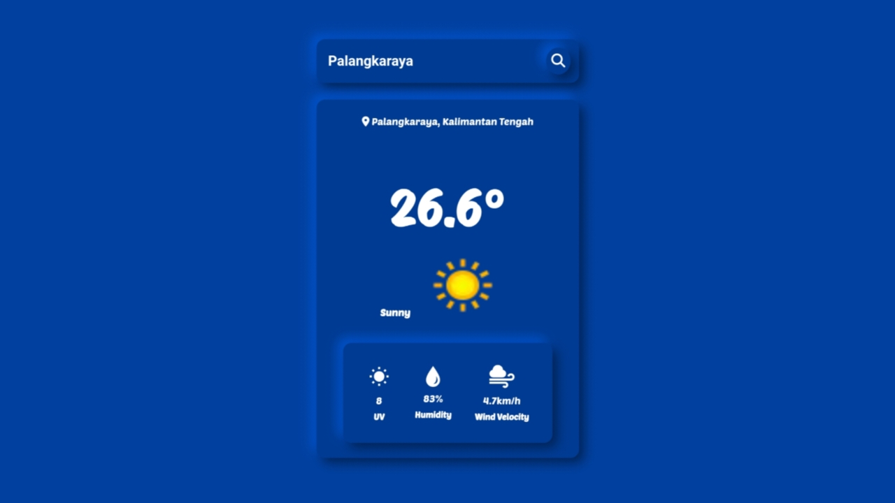

---
<a href='https://weather-app-nine-blush.vercel.app/'>
  
</a>

## weather app

Aplikasi cuaca sederhana yang memungkinkan pengguna mendapatkan informasi cuaca terkini dan prakiraan cuaca untuk suatu kota menggunakan API dari weatherapi.

## Fitur

- Pencarian cuaca berdasarkan nama kota
- Menampilkan cuaca saat ini dalam satuan suhu celcius (c°).
- Menampilkan kecepatan angin berdasarkan lokasi.
- Menampilkan nilai kelembabpan berdasarkan lokasi.
- Menampilkan nilai suhu uv berdasarkan lokasi.
- Mendapatkan cuaca berdasarkan lokasi pengguna saat ini

## Teknologi yang Digunakan

- HTML
- CSS
- JavaScript
- [weatherapi](https://www.weatherapi.com/)

## Cara Menggunakan

1. **Pencarian Berdasarkan Nama Kota:**
   - Masukkan nama kota di kolom input.
   - Klik tombol "Search" atau tekan "Enter".


## Konfigurasi kalo mau pake API sendiri

1. Ganti `YOUR-API-KEY-HERE` di file JavaScript dengan API key Anda dari  [weatherapi](https://www.weatherapi.com/).

```javascript
const API_KEY = "YOUR-API-KEY-HERE"; // API key untuk OpenWeatherMap API
```

2. Buka `index.html` di browser web.

---
